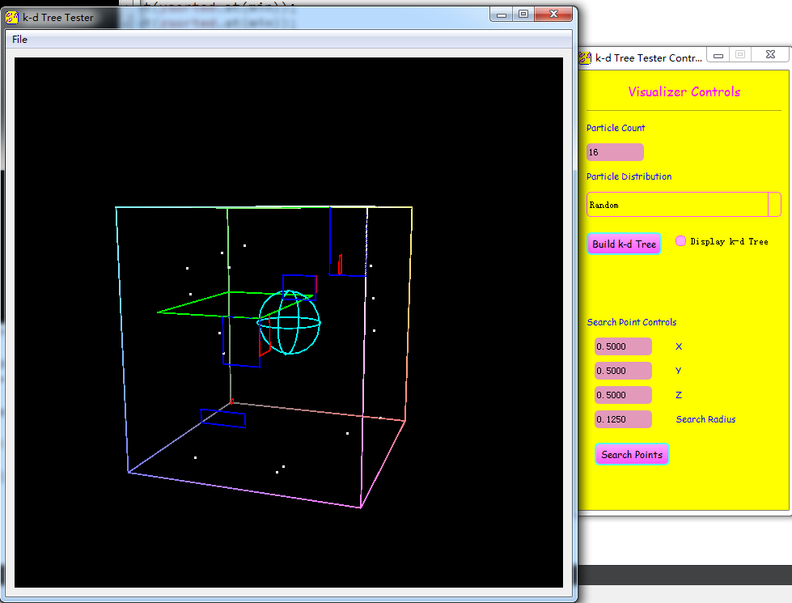
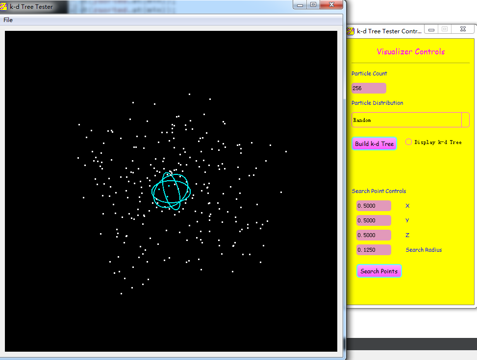
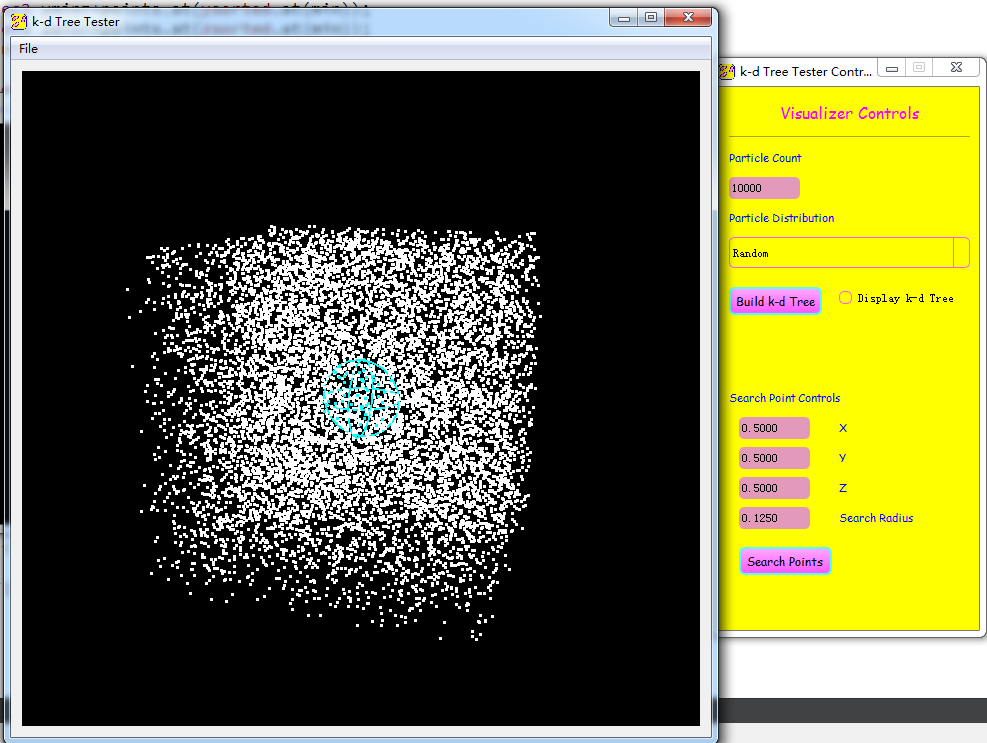

# CIS561 HW8 KDTREE

All the qDebug stuff (which was used to check every position) are commented.

If you wish to see the details, Uncomment them all. 

## Algorithm ##

### First thing first, this is a recursive method, the looping version was not good enough(and low efficiency). ###

### Be careful about recursion depth, that varies through computers ans systems. ###

Before the KD Tree is build, all points are sorted using insert sorting (Wikipedia said that this is the quickest sorting.)

They are sorted x, y, z sequence, so we got 3 int vectors which stored their relative address in the original vector.

Then, KDTree::Recursive will be called in the build function, to build up a KDTree. 

When you see the "build finished", that means the KD Tree is ready for searching. 

## Segmentation ##

This segment is only 16 points, just for illustration of how the KD Tree is done. 

## Searching Part ##

256 points: 

1024 points: 

10K points: 

Generally the program runs well, except for the 10K part, which took a few seconds to build up the KD Tree. 

BTW, if you enabled qDebugs, it will be even SLOWER. 
